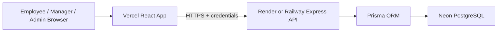

# Architecture

## Production Architecture



## Application Layers

- `client`: React, Vite, TailwindCSS, Recharts.
- `server`: Express REST API, JWT auth, role middleware, audit helper, reporting/export services.
- `database`: PostgreSQL managed through Prisma migrations.

## Module Boundaries

- Auth: login, logout, session restore, role permissions.
- Employee Goals: draft CRUD, submit workflow, employee editing rules.
- Manager Workflow: team review, inline target/weight edits, approve/reject.
- Quarterly Check-ins: planned target, actual achievement, progress engine, manager comments.
- Admin: users, hierarchy, unlocks, audit logs, cycle configuration.
- Reports: aggregations, charts, CSV export, Excel-compatible export.

## Security Model

All protected APIs require a verified JWT cookie. Role access is enforced by middleware:

```text
requireAuth -> requireRole(...)
```

Admin and manager APIs also apply data scope checks in services so users cannot access records outside their authority.
